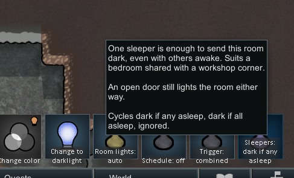

# Room Auto Light

A RimWorld 1.6 mod that treats every room's lamps as **one aggregated switch** instead of a pile of
independent buildings.



## Behaviour

- **Open a door and the room lights up.** Any door touching a room being physically open switches that
  room's whole group on.
- **Seal it and leave and the room goes dark.** A room only turns off once every door to it is closed
  *and* nobody is inside, after a short delay so a pawn walking through does not strobe the lights.
- **Sleepers count as nobody.** By default a room goes dark once every occupant is asleep, and lights
  back up the moment one wakes. Per-room, and never applied outdoors.
- **The group flips as one.** Every lamp in a room changes state on the same tick. Rooms are staggered
  against each other across the re-evaluation window, so the work is spread without ever splitting a
  room across ticks.
- **Schedules.** Any group can be put on a schedule instead of on triggers: `dusk to dawn` follows the
  clock, `on darkness` follows how dark it actually is.
- **The outdoors is one group.** Every player-owned lamp standing outdoors is driven as a single
  switch, defaulting to `on darkness`, rather than trying to automate the map-sized outdoor "room".
- **Power is aggregated, all or nothing.** A room only lights up if the grid can pay for every one of
  its lamps at once, so it never comes up half lit. A dark group draws nothing, and selecting any
  lamp shows the group as a single load — lamp count, wattage, current state, and why.
- **Any lamp can be pulled out.** `Ungroup lamp` hands one lamp back to vanilla, keeping it out of
  both the group switching and the all-or-nothing power check.

## The switches

Select any lamp and you get two commands for its whole group.

`Room lights` (or `Outdoor lights`) cycles:

| Mode | Meaning |
| --- | --- |
| `auto` | Doors and occupancy drive the group |
| `always on` | The group is held lit |
| `always off` | The group is held dark |

`Schedule` cycles:

| Schedule | Signal | Meaning |
| --- | --- | --- |
| `off` | — | Doors and occupancy drive the group |
| `dusk to dawn` | `GenCelestial.CurCelestialSunGlow` | Pure clock. Weather and eclipses are ignored, so dusk stays dusk |
| `on darkness` | `SkyManager.CurSkyGlow` | How dark it actually is. An eclipse or a black storm at noon lights the group |

While a schedule is set it is the *only* thing deciding — doors and occupants are ignored — which is
what makes it usable for perimeter lighting. `always on` and `always off` still override it. Both
thresholds are configurable; the dusk one defaults to vanilla's own day/night cutoff of 0.60.

The darkness signal deliberately reads sky glow, not the glow grid. Reading the light the lamps
themselves cast would make the group oscillate.

`Trigger` cycles which signals drive the group on auto (indoor groups only — every door on the map
touches the outdoors, so the door trigger is meaningless there):

| Setting | Meaning |
| --- | --- |
| `combined` | Default. An open door **or** an occupant lights the room |
| `occupancy` | Occupants only. A door swinging open on an empty room leaves it dark — a room people pass by more than enter |
| `doors` | Open doors only. Someone standing in it with the door shut leaves it dark — a corridor or an airlock |

`Sleepers` cycles how the group treats sleeping occupants (indoor groups only — sleep never darkens
the outdoors):

| Setting | Meaning |
| --- | --- |
| `dark if any asleep` | One sleeper sends the room dark even with others awake — a bedroom with a workshop corner |
| `dark if all asleep` | Default. Dark once everyone is asleep, lit again the moment one wakes |
| `ignored` | Sleepers hold the lights on — a hospital or a barracks lit round the clock |

An open door still lights the room in every case. The starting value for new rooms is a global
setting; rooms left at that value follow it if you change it later.

`Ungroup lamp` is per lamp rather than per group. An ungrouped lamp keeps its own switch and its own
power, and is left out of the all-or-nothing check — which is the escape hatch when a room genuinely
cannot afford every lamp. The control stays on the lamp while it is ungrouped, so it can rejoin.

Selecting several lamps from the same group collapses into one set of commands. Choices survive
saving and reloading — they are anchored to a cell rather than a room id, because room ids are
rebuilt from scratch whenever a wall moves.

## How it works

### Switching the group on the same tick

Releasing a lamp is not enough to light it. `PowerNet.PowerNetTick` restores waiting parts on a
deliberate drip-feed:

```
interval = max(200 / partsWantingPowerOn.Count, 30)      // at best once every 30 ticks
if (TicksGame % interval != 0) return
count = max(1, round(partsWantingPowerOn.Count * 0.05))  // ~5% of them
comp  = partsWantingPowerOn.RandomElement()              // in random order
```

Left to that, a five lamp room comes up one lamp at a time over several seconds. So the group
releases every member and then sets `PowerOn` on each itself, in one pass, guarded by the same
conditions `CompPowerTrader.PowerOn` would otherwise warn about.

### Holding a lamp off

RimWorld already routes every re-power decision through `FlickUtility.WantsToBeOn`:

- `PowerNet.PowerNetTick` skips comps that do not want to be on,
- `CompPowerTrader.PowerOn` refuses to be set true for them,
- `CompGlower.ShouldBeLitNow` consults it before lighting.

So the mod holds a lamp dark by answering "no" there and dropping `PowerOn` once. There is no per-tick
fight with the power net, no synthetic flick, and — because `CompPowerTrader.UpdateOverlays` only
shows the power-off icon for *flicked* buildings — no overlay clutter on auto-off lamps.

## What counts as a lamp

Plain `Building` things carrying both a glower and a power trader, drawing under the configured
ceiling. That deliberately picks up modded lamps while skipping sun lamps (`Building_SunLamp`),
workbenches, TVs and turrets, which all carry their own `thingClass`. Settings expose defName
include/exclude lists for anything the heuristic gets wrong.

## Settings

Default trigger link, held-open doors, animals, default sleeper handling, all-or-nothing power and
its retry delay, the delay before going dark, the
re-evaluation interval, the glow levels that count as dusk and as dark, whether outdoor lamps are
grouped, the wattage ceiling, and the defName overrides.

## Grow rooms

Sun lamps are never switched by this mod — vanilla already schedules them. `SunLamp` carries a
`CompProperties_Schedule` of `startTime 0.25` / `endTime 0.8` with the message *"Off for plant
resting period"*, enforced through the same `FlickUtility.WantsToBeOn` path this mod uses.

What the mod does instead is cover the gap that schedule leaves. A room's ordinary lamps **stand
down while a sun lamp in the same room is lit** — nothing a 30 W lamp adds is visible next to a sun
lamp — and go back to their normal triggers the moment it enters its plant resting period. So the
grow room is bright all day on the sun lamp alone, and the standing lamps pick up the night shift for
whoever is still harvesting, instead of leaving them in the dark.

Grow lights are detected as `Building_SunLamp` or any glower with `overlightRadius` at or above the
configured threshold (4.0). Vanilla's sun lamp is 7.0; the other two vanilla things that use the
field, `LightBall` (2.0) and `Loudspeaker` (1.5), fall below it. Modded plant lights that miss both
tests can be listed by defName in settings.

`always on` overrides the stand-down, so a room you want lit regardless still is.

## Building

```bash
dotnet build Source/RoomAutoLight.csproj
```

Output lands in `1.6/Assemblies/`. Set `RimWorldPath` in the csproj if RimWorld is not at the default
Steam location.
